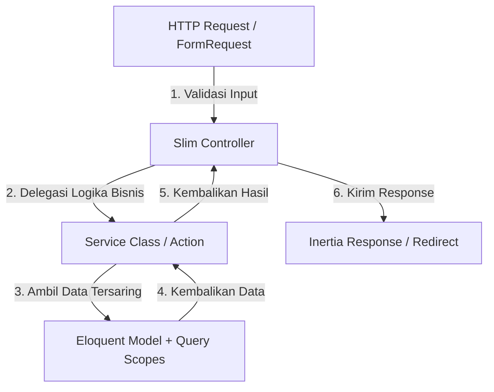

# Panduan Standar Arsitektur Bersih (Clean Architecture) — Tokona ERP & CRM

Panduan ini mendefinisikan arsitektur sistem, standar penulisan kode (*clean code*), dan praktik terbaik (*best practices*) yang wajib dipatuhi di seluruh proyek **Tokona POS + ERP SaaS**.

---

## 1. STRUKTUR RANCANGAN BACKEND (LARAVEL)

Untuk menjaga kode tetap bersih, mudah diuji, dan aman dari bug, kita menerapkan pemisahan tanggung jawab secara ketat (*Separation of Concerns*) dengan pola **Controller ➔ Service ➔ Query Scope**:



### A. Lapisan Form Request (Validasi Input)
*   Setiap aksi menulis (`store`, `update`) wajib divalidasi menggunakan kelas **Form Request** terpisah (misal: `StoreUserRequest`, `UpdateExpenseRequest`).
*   Controller **tidak boleh** melakukan validasi manual `$request->validate()`.
*   Aturan validasi wajib menyertakan kejelasan tipe data, keunikan model, dan batasan `exists` database.

### B. Lapisan Controller (Mediator Tipis / Slim Controller)
*   **Hukum Utama**: Controller harus super tipis (maksimal 20-30 baris per fungsi).
*   Controller **hanya** bertugas sebagai penghubung:
    1.  Menerima input yang telah divalidasi dari `FormRequest`.
    2.  Memanggil kelas **Service** yang sesuai untuk memproses logika bisnis atau kalkulasi.
    3.  Mengembalikan **Inertia::render()** atau **RedirectResponse** dengan *flash message* sukses/gagal.
*   Controller **dilarang keras** melakukan query database manual (seperti `where`, `groupBy`, `selectRaw`), perhitungan matematika, pemrosesan transaksi (`DB::transaction`), atau penentuan `tenant_id` secara manual.

### C. Lapisan Service (Logika Bisnis & Perhitungan)
*   Diletakkan di dalam folder `app/Services/` (misal: `app/Services/FinanceService.php`, `app/Services/ExpenseService.php`).
*   Kelas Service menangani seluruh logika bisnis utama:
    *   Pemrosesan data baru/pembaruan.
    *   Pengambilan kesimpulan status keuangan.
    *   Perhitungan statistik dashboard, akumulasi laba-rugi, dan mutasi saldo kasir.
    *   Pencatatan transaksi database berurutan (`DB::transaction`).

### D. Lapisan Model & Query Scopes (Saringan Database)
*   Seluruh logika penyaringan query (seperti pencarian teks `search`, filter cabang `branch_id`, atau batasan tanggal) wajib diletakkan di dalam **Eloquent Query Scopes** pada model masing-masing.
*   Model juga dilindungi secara otomatis oleh **Global Tenant Scope** untuk mengisolasi data antartoko secara transparan tanpa perlu menulis `where('tenant_id', ...)` di setiap query.

### E. SELALU BERPEGANGAN KE HAL YANG DI REKOMENDASIKAN SAAT KODING AGAR KODE MENJADI SIMPLE DAN BERSIH
* Kode di front end kalau bisa tidak sampe 500 baris maka harus di pecah dna di pilah menjadi beberapa komponen.
* Seragamkan semua komponen yg sudah ada misalnya table 
* Jangan membuang waktu untuk memikirkan hal hal yang tidak perlu,karena akan membuang waktu percuma.
* Selalu mengutamakan modern dan efisien dalam berpikir.
* Fokus pada logika bisnis.
* Jangan memikirkan hal hal yang tidak perlu.
* Pake lodash untuk persimple misal === jadi equals di lodash dan lainnya. (Kalo bisa)
* Kalo bisa pake bahasa yang simple jangan bertele tele.
* Jangan ada icon apapun di komentar agar tidak ketahuan kalau pake AI.
---

## 2. STRUKTUR RANCANGAN FRONTEND (REACT)

Untuk memastikan antarmuka terasa hidup, responsif, dan konsisten di mata pengguna, standardisasi berikut wajib diimplementasikan di setiap modul:

### A. Standardisasi DataTable & Saringan Eksternal (`extraParams`)
Setiap halaman daftar data wajib menyajikan antarmuka tabel dan saringan pencarian yang **seragam**:

1.  **Kontainer Saringan (Filter Header)**:
    *   Dibungkus menggunakan kontainer khusus dengan latar belakang bernuansa premium: `bg-muted/30 p-4 rounded-lg border border-border flex flex-wrap items-center gap-4`.
    *   Setiap elemen input dropdown (`Select`) wajib memiliki label berketerangan kecil di atasnya dengan format: `text-xs font-semibold text-muted-foreground uppercase tracking-wider`.
2.  **Debounced Search & Dynamic Filters**:
    *   Menggunakan komponen global `DataTable` yang mendukung `extraParams` untuk menggabungkan saringan eksternal (seperti cabang/status) dengan pencarian teks debounced TanStack secara mulus.
3.  **Aksi Tambah & Ekspor**:
    *   Tombol ekspor data csv (`Export CSV`) dan tombol tambah data utama (`Tambah ...`) diletakkan di sisi kanan atas header tabel secara konsisten.

### B. Standardisasi Pemformatan Data Global (Helpers)
* Pada table semua filterisasinya harus sama persis untuk tampilaanya dan juga untuk logic pengambilan datanya.
*   Seluruh nominal mata uang Rupiah **wajib** diformat menggunakan helper global `formatRupiah(number)` yang di-import dari `@/lib/helpers/format`. Dilarang keras menggunakan `toLocaleString()` manual di komponen UI.
*   Seluruh penunjuk waktu **wajib** menggunakan helper global `formatDate(date)` (tanggal pendek) atau `formatDateTime(date)` (tanggal lengkap dengan jam).

### C. Zustand vs Inertia (Aturan Manajemen State)
*   **Inertia State**: Gunakan untuk data dinamis yang persisten dari database. Seluruh penyimpanan data baru/pembaruan menggunakan `useForm` dari `@inertiajs/react`.
*   **Zustand State**: Gunakan murni untuk menyimpan status antarmuka sementara (*UI State*) seperti status buka-tutup dialog/modal (`isFormOpen`), data baris yang sedang diedit (`selectedUser`), atau status baris yang terpilih.

---
## 3. CONTOH IMPLEMENTASI SEBELUM VS SESUDAH

### Laravel Controller (Refaktorisasi Arsitektur Bersih)

#### ❌Sebelum (Controller Kembung / Fat Controller):
```php
public function index(Request $request) {
    // BURUK: Query database, saringan filter, dan kalkulasi matematika menumpuk di controller!
    $query = Expense::query();
    if ($request->filled('search')) { $query->where('title', 'like', "%{$request->search}%"); }
    if ($request->filled('branch_id')) { $query->where('branch_id', $request->branch_id); }
    
    $total = $query->sum('amount');
    $thisMonth = $query->whereDate('expense_date', '>=', now()->startOfMonth())->sum('amount');
    $expenses = $query->paginate(15);
    
    $branches = Branch::where('tenant_id', auth()->user()->tenant_id)->get();
    
    return Inertia::render('expenses/index', compact('expenses', 'total', 'thisMonth', 'branches'));
}
```

####  Sesudah (Slim Controller + Service + Scope):
```php
// 1. Controller sangat tipis dan bersih
public function index(Request $request, ExpenseService $expenseService) {
    $data = $expenseService->getExpenseListData($request->all());
    return Inertia::render('expenses/index', $data);
}

// 2. Logika query diletakkan di Model (Query Scope)
class Expense extends Model {
    public function scopeFilter($query, array $filters) {
        $query->when($filters['search'] ?? null, function ($q, $search) {
            $q->where('title', 'like', "%{$search}%");
        })->when($filters['branch_id'] ?? null, function ($q, $branchId) {
            $q->where('branch_id', $branchId);
        });
    }
}

// 3. Perhitungan matematika dan penyiapan data di Service Class
class ExpenseService {
    public function getExpenseListData(array $filters) {
        $expenses = Expense::filter($filters)->paginate($filters['per_page'] ?? 15);
        $total = Expense::filter($filters)->sum('amount');
        
        return [
            'expenses' => $expenses,
            'stats' => [
                'total' => $total,
            ],
            'branches' => Branch::orderBy('name')->get(),
        ];
    }
}
```

---

Dengan mematuhi manifesto di atas, basis kode Tokona ERP & CRM dijamin **sakat sehat, sangat stabil, 100% type-safe**, dan siap dikembangkan oleh tim developer skala besar!
